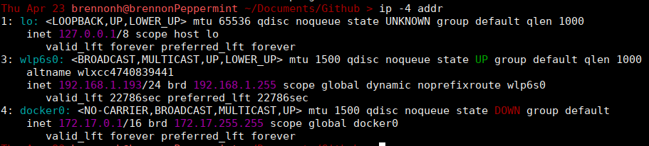
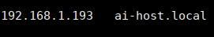

# Host Ollama on a Server
### On Server Computer (computer to host AI)
1. Install Ollama
    - Linux:
        ```bash
        curl -fsSL https://ollama.com/install.sh | sh
        ```
        Mac is the same, but you can also install [here](https://ollama.com/download/mac)
    - Windows
        ```bash
        irm https://ollama.com/install.ps1 | iex
        ```
        Or [here](https://ollama.com/download/windows)


2. Run a specific model
    1. Configure Ollama to be accessable from another computer
        1. ```bash
            sudo systemctl edit ollama
            ```
        2. Type "i" to enter insert mode for the Vim editor (more info [here](https://www.redhat.com/en/blog/beginners-guide-vim))
        3. Paste this by using ctrl+shift+v (or right click -> Paste): 
            ```bash
            [Service]
            Environment="OLLAMA_HOST=0.0.0.0"
            Environment="OLLAMA_ORIGINS=*"
            ```
            Exactly after where it says
            ```bash
                ### Editing /etc/systemd/system/ollama.service.d/override.conf
                ### Anything between here and the comment below will become the contents of the drop-in file
            ```
        4. Hit escape, then type ":wq" and press enter
        5. Run these two commands to save the changes
            ```bash
            sudo systemctl daemon-reload
            sudo systemctl restart ollama
            ```
        6. If it worked, you should see `*:11434` or `0.0.0.0:11434` when `ss -tulpn | grep 11434` is run (Windows equivalent is hard to describe, Google the goat for that)
        
    2. Run the model
        ```bash
        ollama run mistral
        ```
        if using Mistral. Mistral can be replaced by other models. To see list, look [here](https://ollama.com/search)

3. (OPTIONAL) Look at running ports to figure out where Ollama is running. Its defualt port is port 11434, but run this command just in case.
    ```bash
    sudo ss -tulpn | grep ollama
    ```

4. Expose the port to your network
    - Linux/Mac
        - Ubuntu and Debian-based distros
            ```bash
            sudo ufw allow 11434/tcp
            ```
        - RHEL, CentOS, Fedora, Rocky Linux, and AlmaLinux distros
            ```bash
            sudo firewall-cmd --add-port=11434/tcp --permanent
            ```
            
    - Windows - This is a little more complicated. 
        - Either run this using [Powershell](https://learn.microsoft.com/en-au/answers/questions/5863977/how-to-access-power-shell-on-win-11):
        ```bash
        New-NetFirewallRule -DisplayName "Allow Custom Port" -Direction Inbound -LocalPort 11434 -Protocol TCP -Action Allow
        ```
        - Or follow these steps located [here](https://www.databasemart.com/kb/open-port-in-windows-firewall)
5. Ollama should now be able to be accessed from any computer. Before moving to the other computer, take note of your ip address using the command
    ```bash
    ip -4 addr
    ```
    Output should look something like this
    
    Where the ip address is under the wlp6s0 interface (basically anything "w" is Wi-Fi)
    - If having trouble, assume ip starts with 192.168, most home networks have this network bit start
### On Client Computer
1. Open Notepad by right clicking on the application and selecting "Run as administrator." 
2. Navigate to `File > Open`, and then find `C:\Windows\System32\drivers\etc\hosts`
3. Take the IP from before (e.g. `192.168.1.193`) and type it, along with `ai-host.local`. It should look something like this:

    
    - This will now take the IP address from the server and map it to `ai-host.local`, allowing you to access Ollama using `ai-host.local` instead of having to remember a full IP Address every time.
4. Save the file
5. You will now be able to write programs using `ai-host.local:11434`
